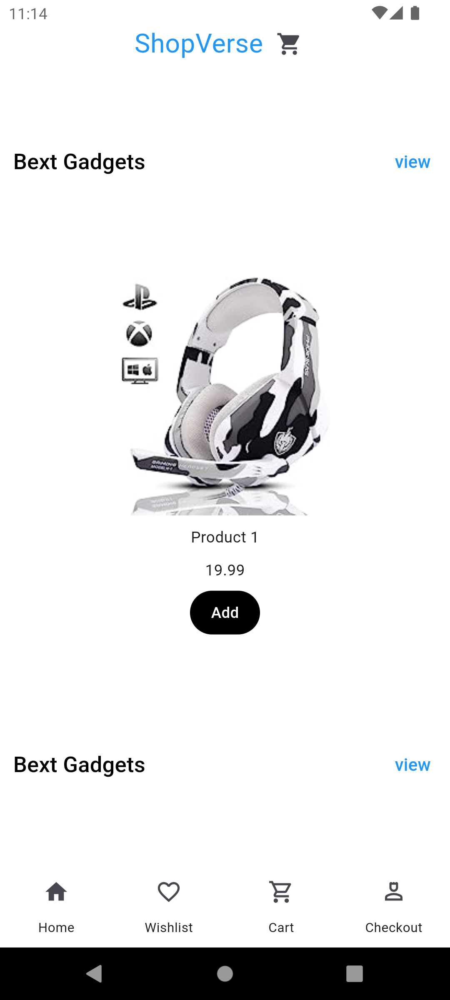
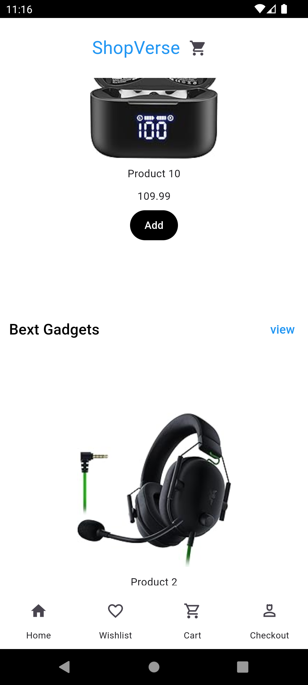
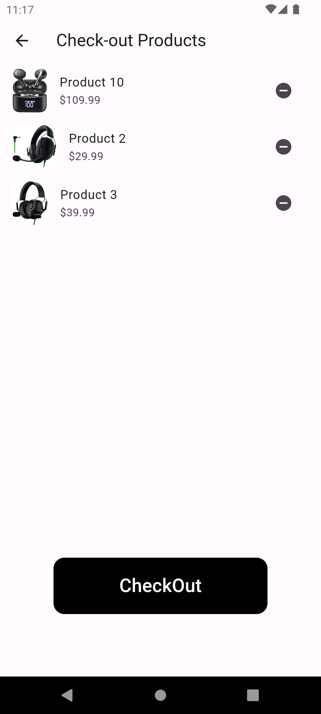
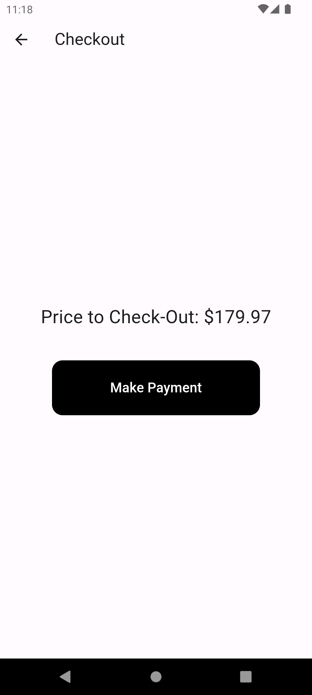
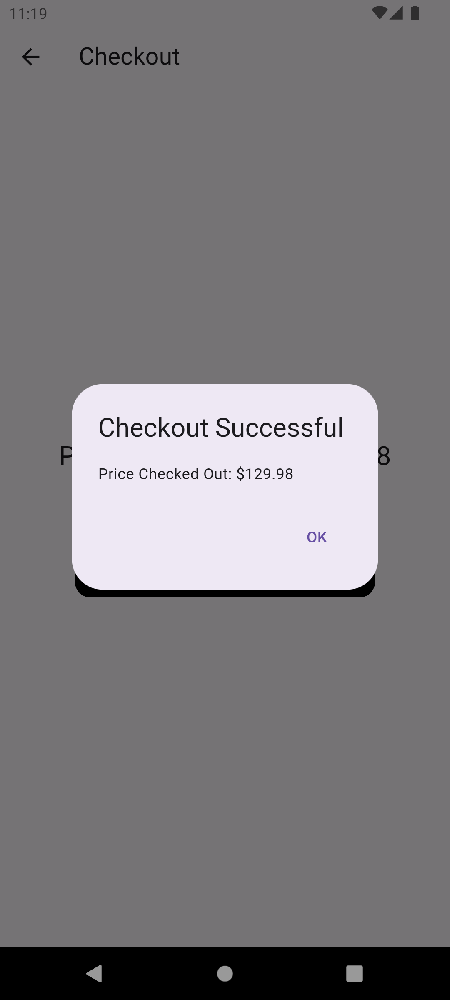

# Shopverse Mobile App

Welcome to **Shopverse** – Your ultimate mobile shopping solution! Shopverse allows users to effortlessly browse, buy gadgets , and place orders using the mobile app

## Table of Contents
- [Features](#features)
- [Installation](#installation)
- [Usage](#usage)
  - [Browsing Products](#browsing-products)
  - [Placing an Order](#placing-an-order)
 

- [Screenshots](#screenshots)

## Features
- **User-Friendly Interface**: Simple and intuitive design for a seamless shopping experience.

## Installation
1. **Download the app**: Available on [Google Play Store](#) and [Apple App Store](#).
2. **Install the app**: Follow the on-screen instructions to install the app on your mobile device.
3. **Sign Up/Login**: Create a new account or log in using your existing credentials.

## Usage

### Browsing Products
1. **Home Screen**: Explore featured products and categories.

### Placing an Order
1. **Select Product**: Tap on a product to view its details.
2. **Add to Cart**: Click on 'Add to Cart' to include the product in your shopping cart.
3. **View Cart**: Go to your cart to review selected items.
4. **Checkout**: Proceed to checkout by entering your shipping details.

## Screenshots
- HomePage
 
 
- HomePage2
 
  
- Cart Page
 
  
- Check-Out page with price
 
  
- Check-Out Successful
  

## View
Appetizer view

interact with the website using this link https://appetize.io/app/e5smlxelxeqzhnz2z4gqdgmhri?device=pixel7&osVersion=13.0&record=true

---
